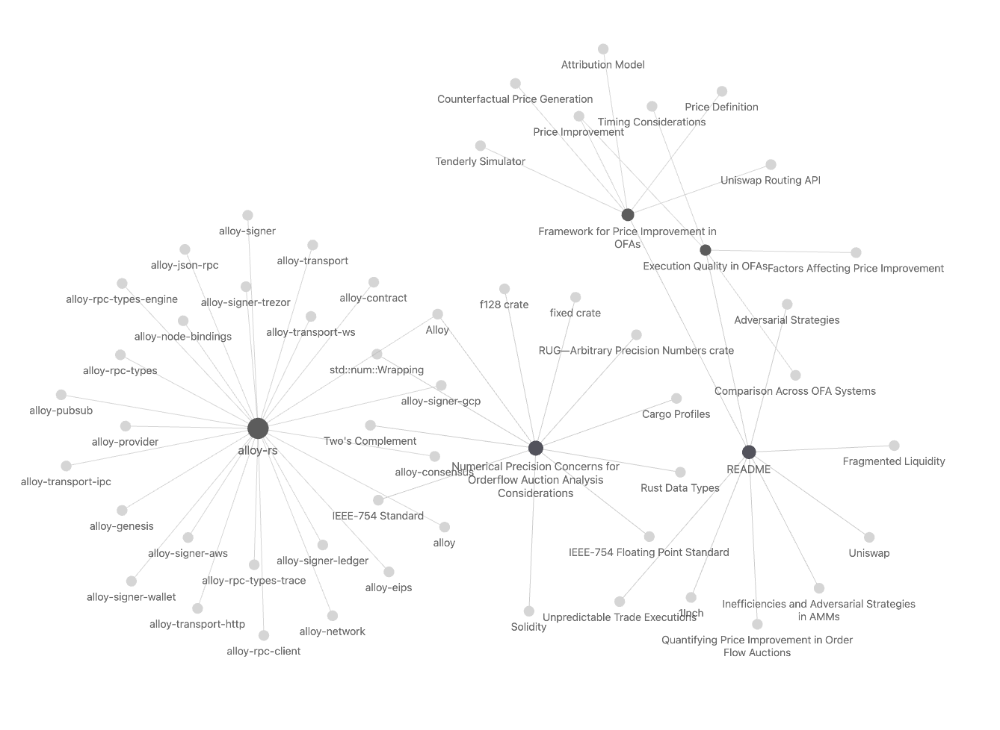

# [[Quantifying Price Improvement in Order Flow Auctions]]

## Navigation
- [[#Overview|Overview]]
- [[#Links|Links]]
- [[#Challenges for AMMs|Challenges for AMMs]]
- [[#Empirical Findings|Empirical Findings]]
- [[#Mathematical Formulations|Mathematical Formulations]]

## Overview
This section summarizes the key points from the paper "[[Quantifying Price Improvement in Order Flow Auctions]]" by Bachu, Wan, and Moallemi.

## Links
- [[Quantifying Price Improvement in Order Flow Auctions]]
- [[Framework for Price Improvement in OFAs]]
- [[Execution Quality in OFAs]]

## Challenges for AMMs
The paper identifies several challenges faced by Automated Market Makers (AMMs) on blockchain systems like Ethereum:

1. **[[Fragmented Liquidity]]**: AMMs encounter issues with [[Fragmented Liquidity]]
2. **Susceptibility to Adversarial Strategies**: AMMs are susceptible to [[Adversarial Strategies]] that can extract value from the system.
3. **Unpredictable Trade Executions**: AMM [[Unpredictable Trade Executions]] can be unpredictable.

These challenges have led to significant financial losses in the ecosystem, with studies estimating that [[Inefficiencies and Adversarial Strategies in AMMs]] have extracted over $540 million USD from the AMM ecosystem over 32 months.

## Empirical Findings
The methodology was applied to historical data from OFA interfaces like [[1Inch]] and [[Uniswap]], revealing that:

1. **Price Improvement Findings**: OFAs, particularly those utilizing RFQ-informed onchain Dutch auction systems (like 1Inch Fusion and UniswapX), can achieve significant price improvements compared to traditional AMMs.

2. **Attribution Findings**: The majority of price improvements on both 1Inch and Uniswap interfaces are achieved through better routing and access to additional liquidity sources. OFAs like 1Inch Fusion and UniswapX show a small but non-zero amount of gas overhead compared to traditional AMMs like Uniswap Classic, translating to 0.5-1 basis points of degradation. The interaction between gas efficiency and priority fee savings also contributes a decent amount to the overall price improvements.
3. **Comparison Findings**: At the interface level, the Uniswap interface provides significantly higher price improvements than the 1Inch interface, except for a few blocks prior to settlement. Both interfaces demonstrate statistically significant positive price improvements compared to the common baseline across a range of block offsets.

### Mathematical Formulations

The key mathematical formulations presented in the paper are:

1. **Price Definition**:
   - For transactions where the input or output token is the gas token (e.g., ETH/WETH):
     $$p = \frac{o}{i + g(b + f)}$$

   - For transactions where gas is internalized by the OFA:
     $$p = \frac{o}{i}$$

     The paper presents the following price definitions:

1. For transactions where the input or output token is the gas token (e.g., ETH/WETH):

   $$p = \frac{b' - b}{a - a'} = \frac{o}{i + g(b + f)}$$

   Where:
   - $p$ is the realized price
   - $b'$ and $b$ are the post-trade and pre-trade balances of the output token
   - $a'$ and $a$ are the post-trade and pre-trade balances of the input token
   - $o$ is the amount of output token received
   - $i$ is the amount of input token provided
   - $g$ is the amount of gas used
   - $b$ is the base fee per gas
   - $f$ is the priority fee per gas

2. For transactions where gas is internalized by the OFA:

   $$p = \frac{o}{i}$$

   Where:
   - $p$ is the realized price
   - $o$ is the amount of output token received
   - $i$ is the amount of input token provided

These price definitions ensure that the transaction costs, including gas fees, are properly accounted for when calculating the realized price of a trade. This allows for a consistent comparison of prices across different OFA systems, regardless of how they handle gas costs.

2. **Price Improvement (PI)**:
   - $$\pi = \frac{p - p'}{p'}$$
   - Where $p$ is the realized price and $p'$ is the counterfactual baseline price
The paper defines price improvement (PI) as:

$$\pi = \frac{p - p'}{p'}$$

Where:
- $\pi$ is the price improvement
- $p$ is the realized price of the trade
- $p'$ is the baseline or counterfactual price

The baseline price $p'$ is defined as:

$$p' = p(x')$$

Where $x' = (o', f')$ is the baseline vector, containing the counterfactual output amount $o'$ and priority fee $f'$.

The baseline is primarily generated by calling the Uniswap Classic routing API with historical blockchain state data to simulate a counterfactual trade at the settlement time of the actual trade.

This definition of price improvement allows for a consistent comparison of the realized trade price against a reasonable baseline, taking into account the specific blockchain conditions at the time of settlement.

The paper also introduces the concept of price improvement over time:

$$\rho(p; p', \Delta t) = \frac{p - p'(\Delta t)}{p'(\Delta t)}$$

Where $\Delta t$ is the time offset from the settlement time. This allows for the evaluation of price improvement at different time points relative to the settlement, capturing the impact of execution speed and timing differences between OFA systems.

3. **Price Improvement Attribution**:
   - $$\pi = \pi_{routing} + \pi_{gas} + \pi_{fee}$$
   - Where:
     - $\pi_{routing}$ represents PI from routing optimization
     - $\pi_{gas}$ represents PI from gas optimization
     - $\pi_{fee}$ represents PI from priority fee optimization
The paper proposes a model to attribute the price improvement ($\pi$) into three components:

$$\pi = \pi_{routing} + \pi_{gas} + \pi_{fee}$$

Where:

1. $\pi_{routing}$ represents the price improvement through optimizing liquidity access. This captures the benefits of including more liquidity sources in the routing compared to the baseline.

2. $\pi_{gas}$ captures the savings from reduced gas costs compared to the baseline. This reflects the trade-off between accessing sufficient liquidity and managing the transaction's cost-effectiveness.

3. $\pi_{fee}$ accounts for the impact of different priority fee settings compared to the baseline. Higher priority fees can offset the gains made through efficient trading and routing strategies.

To compute these attribution components, the paper uses a Taylor series expansion of the price function $p(x)$ around the baseline $x'$:

```math
$$\pi = \left.\frac{\partial p}{\partial o}\right|_{o',g',f'} \cdot \frac{o - o'}{p'} + \left.\frac{\partial p}{\partial g}\right|_{o',g',f'} \cdot \frac{g - g'}{p'} + \left.\frac{\partial p}{\partial f}\right|_{o',g',f'} \cdot \frac{f - f'}{p'} + R(x, x')$$
```

Where $R(x, x')$ represents the remainder term in the Taylor expansion.

This attribution model allows the paper to quantify how much of the overall price improvement can be attributed to the OFA's decisions regarding routing optimization, gas efficiency, and priority fee settings, providing granular insights into the sources of price improvement.

The authors apply this attribution model to the empirical analysis of the 1Inch and Uniswap interfaces, demonstrating how it can be used to compare and optimize the performance of different OFA systems.

4. **PI Attribution Model**:
Using a Taylor series expansion:

```math
\pi = \left.\frac{\partial p}{\partial o}\right|_{o',g',f'} \cdot \frac{o - o'}{p'} + \left.\frac{\partial p}{\partial g}\right|_{o',g',f'} \cdot \frac{g - g'}{p'} + \left.\frac{\partial p}{\partial f}\right|_{o',g',f'} \cdot \frac{f - f'}{p'} + R(x, x')
```

Where $R(x, x')$ is the remainder term

The paper's PI attribution model is described as follows:

The price function $p$ is defined as a function of the OFA controllable variables $x = (o, g, f)$, where:
- $o$ is the output token amount
- $g$ is the gas used
- $f$ is the priority fee per gas

The price improvement $\pi$ is then defined as:

$$\pi = p - p'$$

Where $p'$ is the baseline or counterfactual price.

To attribute the price improvement $\pi$, the paper proposes a Taylor series expansion of the price function $p(x)$ around the baseline $x'$:

```math
$$\pi = \left.\frac{\partial p}{\partial o}\right|_{o',g',f'} \cdot \frac{o - o'}{p'} + \left.\frac{\partial p}{\partial g}\right|_{o',g',f'} \cdot \frac{g - g'}{p'} + \left.\frac{\partial p}{\partial f}\right|_{o',g',f'} \cdot \frac{f - f'}{p'} + R(x, x')$$
```


Where:

```math
\left.\frac{\partial p}{\partial o}\right|_{o',g',f'} \cdot \frac{o - o'}{p'}$ 
```
represents the price improvement due to routing optimization ($\pi_{routing}$)

```math
\left.\frac{\partial p}{\partial g}\right|_{o',g',f'} \cdot \frac{g - g'}{p'}$ 
```
represents the price improvement due to gas optimization ($\pi_{gas}$) 

```math
$ \left.\frac{\partial p}{\partial f}\right|_{o',g',f'} \cdot \frac{f - f'}{p'}$
```
 represents the price improvement due to priority fee optimization ($\pi_{fee}$)
 $R(x, x')$ is the remainder term

The paper then aggregates these components to obtain the overall price improvement:

$$\pi = \pi_{routing} + \pi_{gas} + \pi_{fee} + \pi_{remainder}$$

This attribution model allows the authors to quantify the relative contributions of routing, gas, and priority fee decisions to the overall price improvement achieved by different OFA systems. By breaking down the price improvement in this way, the paper aims to provide OFA implementers with direct insights into how they can optimize their systems to improve trading outcomes for users.

5. **Price Improvement over Time**:
   - $$\rho(p; p', \Delta t) = \frac{p - p'(\Delta t)}{p'(\Delta t)}$$
   - Where $\Delta t$ is the time offset from the settlement time
The paper introduces the concept of price improvement over time, denoted as $\rho(p; p', \Delta t)$, where:

$$\rho(p; p', \Delta t) = \frac{p - p'(\Delta t)}{p'(\Delta t)}$$

Here:
- $p$ is the realized price of the trade
- $p'(\Delta t)$ is the counterfactual or baseline price at a time offset $\Delta t$ from the settlement time
- $\Delta t$ is the time offset from the settlement time

This definition allows the evaluation of price improvement at different time points relative to the settlement time, capturing the impact of execution speed and timing differences between OFA systems.

For example, when $\Delta t = 0$, the price improvement is calculated at the settlement time, which is the primary focus of the paper's analysis. However, by considering different values of $\Delta t$, the authors can assess how price improvement evolves over time, providing insights into the efficiency and responsiveness of the OFA systems.

This time-dependent price improvement metric is particularly useful for comparing OFA systems that may have different execution speeds or timing strategies. It allows the researchers to understand the tradeoffs between faster execution and potentially better prices that may be achieved with a slightly longer execution time.

By incorporating the time dimension, the paper's framework provides a more comprehensive evaluation of the OFA systems' performance, going beyond just the price improvement at the settlement time and considering the dynamic nature of the trading environment.

6. **Baseline Generation**:
   - $$B: (i, t) \rightarrow (o', g')$$
   - Where $B$ is the baseline function that maps input amount $i$ and time $t$ to the counterfactual output amount $o'$ and gas used $g'$
The paper describes the process of generating the baseline for comparison against the OFA systems as follows:

Baseline Function $B$:
The baseline is generated using the Uniswap Classic routing API and the Tenderly simulator. Specifically, the baseline function $B$ maps the input amount $i$ and the settlement block time $t$ to the counterfactual baseline output amount $o'$ and gas used $g'$:

$$B: (i, t) \rightarrow (o', g')$$

The steps involved in generating the baseline are:

1. API Call for Route Calculation:
   - For each completed swap, the authors initiate a request to the Uniswap Classic routing API, providing the input amount $i$ and the state of the blockchain for several blocks surrounding the settlement block.
   - The routing API determines the optimal route through Uniswap pools that maximizes the output token amount, net of gas fees, and provides the corresponding calldata.
   - The API also provides an estimate of the gas costs associated with executing the transaction.

2. Simulation via Tenderly:
   - The calldata obtained from the routing API is then input into the Tenderly blockchain execution simulator.
   - The simulation is performed with a fixed priority fee of 0.1 Gwei and the block number corresponding to the settlement block.
   - Tenderly processes the inputs and returns the simulated output, including the amount of gas consumed and other relevant metadata.

This baseline generation process ensures that the counterfactual price $p'$ is calculated using the optimal route and gas usage that a typical user could have achieved on the Uniswap Classic interface, providing a consistent and reproducible benchmark for comparison.

The paper notes that this baseline is chosen because the Uniswap Classic routing API aggregates a significant portion of the total on-chain liquidity, and it underpins the Uniswap interface, which is a major trading platform.

These mathematical formulations provide the foundation for the framework described in the paper to evaluate and compare the price improvement performance of different OFA systems.
